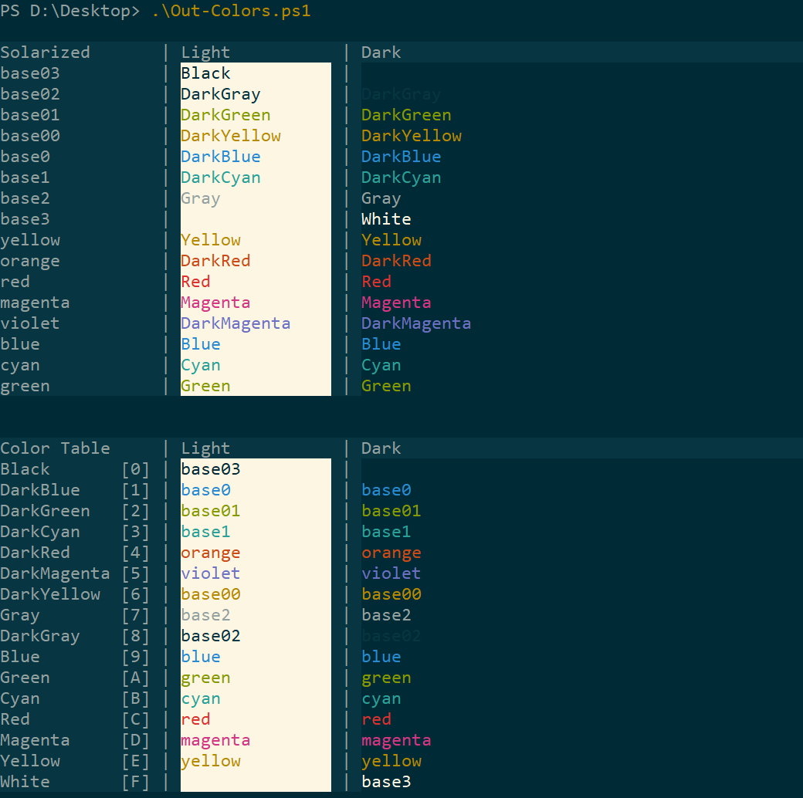

I found this repo [neilpa/cmd-colors-solarized](https://github.com/neilpa/cmd-colors-solarized) months ago, but somehow suffered from some of its "features". Here I am going to talk about how to solve them.

## Parameters in Powershell are too dark to be seen
Actually there are many issues about it. Just refer to <https://github.com/neilpa/cmd-colors-solarized#update-your-powershell-profile> and setup carefully.

### Where on earth to place profile?
LIKELY `~\Documents\WindowsPowerShell\`? Yes, if you doubt the location, check `echo $profile` in your Powershell.

### UnauthorizedAccess?
Just open Powershell as Administrator and `Set-ExecutionPolicy RemoteSigned`

Or you can create your own script and copy the content into it. ( Does not work every time and I don't know why )

## What happened to my [Green, Yellow, Blue, Cyan] ?
As you can see in its README, the Dark[Green, Yellow, Blue, Cyan] can hardly be recognised as [Green, Yellow, Blue, Cyan].

So you can just copy the [Green, Yellow, Blue, Cyan] color values to the Dark[Green, Yellow, Blue, Cyan] ones.

And as you can see, I have changed main color to gray. Because its default color was DarkBlue and after making changes above, the it's necessary to bond another color as primary color.

---

Finally, [here](/file/solarized-dark.reg) is my reg file for dark theme.

## UPDATE: ColorTool

Microsoft actually has its official implementation [ColorTool](https://github.com/Microsoft/Terminal/tree/master/src/tools/ColorTool).
