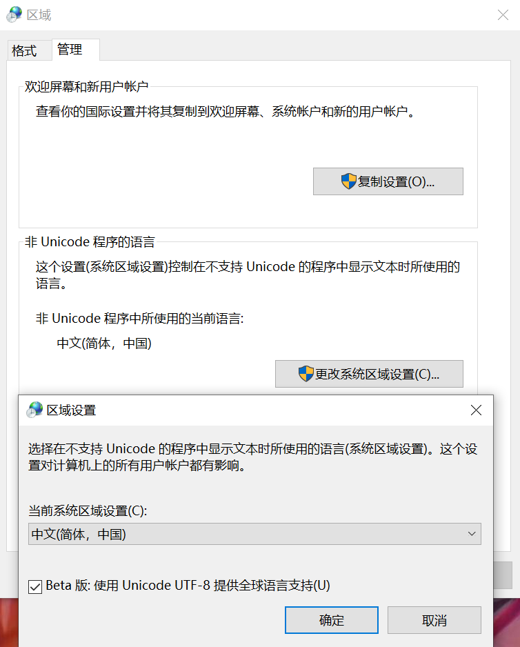

*Based on: <https://answers.microsoft.com/en-us/windows/forum/windows_10-start/how-to-customize-consoles-fonts-in-windows-10/f257d215-66db-4186-86cc-2e0b5056b50c>*

*Note: this answer only works in non-English regions*

## Introduction to the Problem

I have tried for a long time to change to nice font in CMD. After following the tutorials ( [GUI version](https://www.howtogeek.com/howto/windows-vista/stupid-geek-tricks-enable-more-fonts-for-the-windows-command-prompt/) and [non-GUI version](https://devblogs.microsoft.com/powershell/windows-powershell-font-customization/)) on the web and enabling the fonts in the registry, strange things happened:

- PowerShell recognizes the installed font, and can remember as default, but when running programs, it will switch to default ugly font
- CMD recognizes the font only when I right click and choose "Default" (默认值), but not "Properties" (属性)

## Root of the Problem

That's the `Code Page`. I have not heard of this before, but I do know `cp-936` encoding stuff when configuring `gVim`, that is short for `Code Page 936 (ANSI/OEM - 简体中文 GBK)`. 

## Check it Out

When you right click and click "Option" (选项) tab, it will show you the current code page.

In CMD, you can use `chcp 65001` to change Unicode code page. Now right click again and go to "Properties", fonts enabled should be there.

## Solutions

Here are two ways to go:

> It looks like you have installed the Simplified Chinese version of Windows. Do you need to display Chinese text in the console?
>
> If not, and if you don't run legacy Chinese apps that use code page 936 text encoding instead of Unicode, then one option for you is to change the "Language for non-Unicode programs" setting to any language other than Chinese, Japanese or Korean.
>
> To change that setting:
>
> - Press Windows key + R to open the Run dialog.
> - Enter "intl.cpl" (without the quotation marks) and press Enter. This will option the Region control panel dialog.
> - Click on the Administrative tab.
> - In the "Language for non-Unicode programs" section, click the button, Change system locale...

But unfortunately:

> I am sorry that I have to run some legacy Chinese apps which still use non-Unicode encoding.

So here is another way, choose `Beta: Use Unicode UTF-8 for i18n`, in the prompt said above, and click to reboot. 

You will see that CMD is using UFT-8 now, and CMD recognizes those fonts! Enjoy programing!

## Still Problem

PowerShell still changes to `cp 936` when executing commands or running programs :thinking:...
