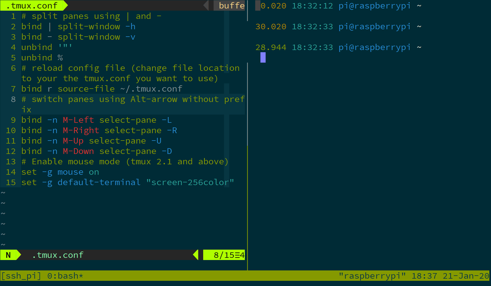

## Cheat Sheet


## Enable 256 color vim

*From https://superuser.com/a/1459904*

First, outside tmux, you need:

```bash
export TERM=xterm-256color
```

in `.tmux.conf`:

```bash
set -g default-terminal "screen-256color"
```

And don't forget to source config manually:

```bash
tmux source-file ~/.tmux.conf
```

All above make sure tmux have full 256 colors support.

And in your `vimrc`, add:

```vim
if exists("$TMUX")
    set t_Co=256
    set notermguicolors
else
    set termguicolors
endif
```

## Resize Panes

```
// This assumes that you've hit ctrl + b and : to get to the command prompt
:resize-pane -D (Resizes the current pane down)
:resize-pane -U (Resizes the current pane upward)
:resize-pane -L (Resizes the current pane left)
:resize-pane -R (Resizes the current pane right)
:resize-pane -D 10 (Resizes the current pane down by 10 cells)
:resize-pane -U 10 (Resizes the current pane upward by 10 cells)
:resize-pane -L 10 (Resizes the current pane left by 10 cells)
:resize-pane -R 10 (Resizes the current pane right by 10 cells)
```

## Still Problem

If I split the panes vertically, the first column of the right pane is overwritten by the separating line.

